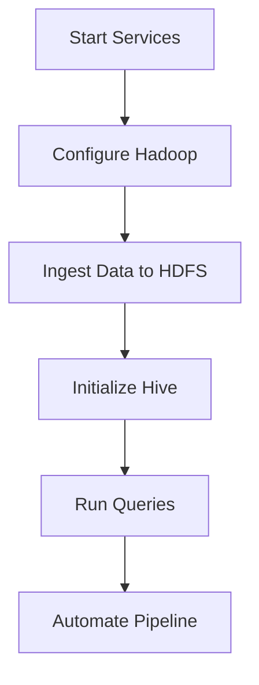

# Dynamic Data Ingestion and Storage in HDFS with Automated Hive Integration

## Problem statement
The goal of this project is to **fetch population data from a specified public dataset URL**, store it in **HDFS**, and create a corresponding **Hive table** to query and visualize the data.The project emphasizes the complete flow from downloading structured data to **automated ingestion and validation** using a script.  

## Approach

1. **Verify Link Access**  
   Check access to the dataset URL:  
   `https://www2.census.gov/programs-surveys/popest/datasets/`

2. **Understand the Dataset**  
   Analyze whether it's structured (e.g., CSV), and determine columns/schema.

3. **Data Retrieval**  
   Use `wget` or `curl` to fetch the file from the source.

4. **HDFS Storage**  
   Store the file in HDFS using:  
   `hadoop fs -put <file> <hdfs_path>`

5. **Hive Table Creation**  
   - Launch Hive CLI  
   - Create a database (if not exists)  
   - Define the table structure based on the CSV format  

6. **Data Loading into Hive**  
   Use:  
   `LOAD DATA INPATH '<hdfs_path>' INTO TABLE <table_name>;`

7. **Validation**  
   Run:  
   `SELECT * FROM <table_name> LIMIT 5;`  
   to verify correctness of the loaded data.

8. **Automation (Optional)**  
   Automate the above workflow using a shell script for scheduled or repeat

## Technologies Used

| Category         | Tools                                |
|------------------|---------------------------------------|
| Data Storage     | HDFS                                 |
| Data Processing  | Hive                                 |
| Automation       | Shell Scripting (`population_data_loader.sh`) |
| Scheduling       | Cron                                 |
| Infrastructure   | Hadoop 3.3.6, Hive 3.1.3, Ubuntu 20.04,MySQL 8.0 (Metastore),Python 3.8 |

## Installation Guide

### 1. Setting Up Ubuntu VM

#### Download Ubuntu 20.04 LTS
```bash
wget https://releases.ubuntu.com/20.04/ubuntu-20.04.6-desktop-amd64.iso
```

### VMware Workstation Download & Setup
Download Links
[Download for Windows](https://www.vmware.com/go/getplayer-win)

Windows
```powershell
# Run installer as Administrator
VMware-player-16.x.x-xxxxxx.exe 
```
### **Virtual Machine Specifications**

| Category               | Setting                  | Recommended Value              | Notes                                                                 |
|------------------------|--------------------------|---------------------------------|-----------------------------------------------------------------------|
| **Hardware**           | vCPUs                    | 4 cores                        | Allocate ≥2 cores for Hadoop services                                 |
|                        | RAM                      | 8 GB (Minimum)                 | 16 GB recommended for production                                     |
|                        | Disk Space               | 50 GB (Thin Provisioned)       | SSD preferred for better I/O performance                             |
| **Software**           | VMware Version           | Workstation 16.x / Player 16.x | [Download Link](https://www.vmware.com/go/getplayer-win)             |
|                        | Guest OS                 | Ubuntu 20.04 LTS               | Server/Desktop edition both supported                                |
| **Network**            | Adapter Type             | Bridged                        | NAT may cause connection issues with cluster services                |
|                        | MAC Address              | Auto-generated                 | Change if cloning VMs                                                |


### Essential packages
sudo apt update && sudo apt install -y \
openjdk-8-jdk \
python3-pip \
mysql-server \
wget \
ssh \

## Hadoop Environment Setup
This section outlines the steps to install Java, download and configure Hadoop, and set environment variables to prepare your system for Hadoop operations.

## 1. Install Java (OpenJDK 8)
```bash
sudo apt update
sudo apt install openjdk-8-jdk -y
```
Note: Java 8 is compatible with Hadoop 3.x versions and is recommended for stable operation.

## 2. Download and Configure Hadoop
```bash
wget https://archive.apache.org/dist/hadoop/core/hadoop-3.3.6/hadoop-3.3.6.tar.gz
tar -xzvf hadoop-3.3.6.tar.gz
mv hadoop-3.3.6 ~/bigdata/
```
* `wget`: Downloads the Hadoop tarball.
* `tar -xzvf`: Extracts the compressed archive.
* `mv`: Moves the extracted folder to a more structured location `(~/bigdata/)`.

## 3. Set Environment Variables
Add the following lines to your ~/.bashrc file to make Hadoop commands globally accessible from the terminal:
```bash
export HADOOP_HOME=~/bigdata/hadoop-3.3.6
export PATH=$PATH:$HADOOP_HOME/bin:$HADOOP_HOME/sbin
```
To apply the changes immediately, run:
```bash
source ~/.bashrc
```
This setup allows you to use commands like hadoop and start-dfs.sh from any directory in your terminal.

## Verify Hadoop Installation & Basic Configuration
After setting up Hadoop, it’s important to confirm the installation and perform the necessary configuration for a single-node cluster.

## 1. Verify Java Installation
Run the following command to check the Java version:
```bash
java -version
```
Expected output should be similar to:
```nginx
openjdk version "1.8.0_xx"
```

## 2. Verify Hadoop Installation
Check if Hadoop is installed and accessible:

```bash
hadoop version
```
## Basic Hadoop Configuration (Single Node Setup)
The following XML files need to be updated to set up Hadoop in pseudo-distributed (single-node) mode:

## 1. core-site.xml
Location: `$HADOOP_HOME/etc/hadoop/core-site.xml`

Replace the `<configuration>` block with:
```xml
<configuration>
  <property>
    <name>fs.defaultFS</name>
    <value>hdfs://localhost:9000</value>
  </property>
<property>
    <name>hadoop.tmp.dir</name>
    <value>/home/ubuntu/hadoop_data/tmp</value>
  </property>
</configuration>
```
## 2. hdfs-site.xml
Location: `$HADOOP_HOME/etc/hadoop/hdfs-site.xml`

Update it as:
```xml
<!-- $HADOOP_HOME/etc/hadoop/hdfs-site.xml -->
<configuration>
  <property>
    <name>dfs.replication</name>
    <value>1</value>
  </property>
  <property>
    <name>dfs.namenode.name.dir</name>
    <value>file:///home/ubuntu/hadoop_data/namenode</value>
  </property>
</configuration>
```
## 3. mapred-site.xml
Location: `$HADOOP_HOME/etc/hadoop/mapred-site.xml`
Edit and add
```xml
<configuration>
  <property>
    <name>mapreduce.framework.name</name>
    <value>yarn</value>
  </property>
</configuration>
```
## 4. yarn-site.xml
Location: `$HADOOP_HOME/etc/hadoop/yarn-site.xml`
Update it with:
```xml
<configuration>
  <property>
    <name>yarn.nodemanager.aux-services</name>
    <value>mapreduce_shuffle</value>
  </property>
</configuration>
```
## 5. Hive Metastore Configuration
```xml
<property>
  <name>hive.metastore.warehouse.dir</name>
  <value>/user/hive/warehouse</value>
</property>
<property>
  <name>hive.exec.scratch.dir</name>
  <value>/tmp/hive</value>
</property>
```
## Workflow



## Stage 1: Start Hadoop Services
Starts the Hadoop Distributed File System (HDFS) daemons:
* __NameNode__ (manages metadata and file system namespace)
* __DataNode__ (stores actual data blocks)

```bash
start-dfs.sh
```
You can verify with:
```bash
jps
```
You should see `NameNode` and `DataNode` running.

## start-yarn.sh
Starts YARN (Yet Another Resource Negotiator) daemons:

* __ResourceManager__ (manages cluster resources)
* __NodeManager__ (manages containers on individual nodes)
```bash
start-yarn.sh
```

Check with:
```bash
jps
```
You should see ResourceManager and NodeManager.

## Stage 2: Configure HDFS
Before first use, HDFS must be formatted:
```bash
hdfs namenode -format -force
```
* -format: Initializes HDFS metadata.
* -force: Suppresses confirmation prompt (useful in scripts).

Run only once during setup. Reformatting will delete HDFS data!

## Stage 3: Data Ingestion into HDFS
### Create Directory in HDFS
Create a directory to hold data:
```bash
hadoop fs -mkdir -p /user/hive/census_data
```
* -p: Creates parent directories if they don’t exist.

### Download and Upload Data
Stream a dataset from a URL directly into HDFS:
```bash
wget -O - https://census.gov/data.csv | hadoop fs -put - /user/hive/census_data/
```
* wget -O -: Downloads the file and writes to standard output.
* hadoop fs -put -: Reads from standard input and uploads to HDFS.
This avoids storing the file locally.

## Stage 4: Initialize Hive Metastore & Services
Initialize Hive Metastore
If using MySQL as Hive metastore DB:
```bash
schematool -dbType mysql -initSchema
```
* Initializes Hive's schema in the MySQL database.

## Start Hive Services
Start Hive services in background (non-blocking):
```bash
nohup hive --service metastore &
nohup hive --service hiveserver2 &
```
* `nohup`: Prevents the service from stopping when the terminal closes.
* `metastore`: Manages Hive metadata.
* `hiveserver2`: Enables remote SQL-like queries using JDBC/ODBC clients.

## Stage 5: Execute a Sample Hive Query
Run a HiveQL command directly from CLI:
```bash
hive -e "CREATE TABLE census_data (...); SELECT COUNT(*) FROM census_data;"
```
* hive -e: Executes a HiveQL string.
* The first part creates a Hive table (structure needs to be defined).
* The second part queries the data.

| Component       | Verification Command                     | Expected Output                                  |
|-----------------|------------------------------------------|--------------------------------------------------|
| **HDFS**        | `hadoop fs -ls /`                        | Shows root directory contents                    |
| **NameNode**    | `curl -s http://localhost:9870 \| grep namenode` | Contains `"namenode"` in HTML output             |
| **YARN**        | `yarn node -list`                        | Lists active nodes with `RUNNING` status         |
| **Hive Metastore** | `netstat -tulnp \| grep 9083`         | `tcp 0 0 0.0.0.0:9083 0.0.0.0:* LISTEN`          |
| **HiveServer2** | `beeline -u jdbc:hive2://localhost:10000 -e "SHOW DATABASES;"` | Lists `project_data` database                          |
| **MySQL**       | `mysql -u hiveuser -p -e "USE metastore; SHOW TABLES;"` | Shows `TBLS`, `DBS` etc.                         |


## Script: population_data_loader.sh
This shell script automates the following:

- Downloading US Census population data
- Uploading it to HDFS
- Creating a Hive table
- Loading data into Hive
- Displaying a sample output

It includes:

- Retry logic
- System monitoring
- Database existence checks
- Logging
- Graceful cleanup

## Configuration Section
```bash
FILE_NAME="sub-est2023_44.csv"
CSV_URL="https://www2.census.gov/..."
LOCAL_PATH="/home/hdoop/$FILE_NAME"
HDFS_PATH="/user/project/dataset/$FILE_NAME"
HIVE_DB="project_data"
HIVE_TABLE="population_data_2"
```

- FILE_NAME: Name of the file to download.
- CSV_URL: Source URL of the dataset.
- LOCAL_PATH: Local path to temporarily store the CSV.
- HDFS_PATH: Destination path in HDFS.
- HIVE_DB, HIVE_TABLE: Hive database and table used.

 ## Logging
 ```bash
LOG_FILE="${0%.*}.log"
exec > >(tee -a "$LOG_FILE") 2>&1
```
- Redirects all script output to a log file with the same name as the script.

## System Resource Monitoring
```bash
monitor_resources() {
    echo -e "\n--- SYSTEM RESOURCES $(date) ---"
    free -h | awk 'NR==1 || NR==2'
    df -h / | awk 'NR==1 || NR==2'
    echo "--------------------------------"
}
```
- Logs memory (free -h) and disk space (df -h /) before major steps.

## Cleanup Handler
```bash
cleanup() {
    echo -e "\n[Cleanup] Removing temporary files..."
    hadoop fs -rm -f "$HDFS_PATH" >/dev/null 2>&1 || true
    [ -f "$LOCAL_PATH" ] && rm -f "$LOCAL_PATH"
    echo "[Cleanup] Complete"
    exit 0
}
trap cleanup EXIT
```
- Ensures clean exit by removing temporary files (HDFS + local) when the script exits.
- Automatically calls cleanup() on script exit (success/failure/interrupt).
- Prevents cleanup failures from crashing the script
  
## Hive DB Verification
```bash
# Verify/Create Hive Database
verify_hive_db() {
    echo -e "\n[Hive] Verifying database..."
    if ! hive -e "USE $HIVE_DB" >/dev/null 2>&1; then
        echo "[Hive] Creating database $HIVE_DB"
        hive -e "CREATE DATABASE IF NOT EXISTS $HIVE_DB" || {
            echo "[Hive] Failed to create database"
            return 1
        }
    fi
    echo "[Hive] Database verified"
    return 0
```
- Checks if Hive database exists.
- If not, it creates it using CREATE DATABASE.

## Download Section
```bashdownload_file() {
    echo -e "\n[Download] Starting download..."
    for ((i=1; i<=MAX_RETRIES; i++)); do
        monitor_resources
        if wget \
            --timeout="$TIMEOUT_SEC" \
            --tries=1 \
            --header="User-Agent: Mozilla/5.0" \
            --header="Accept: text/html" \
            --referer="https://www.census.gov/" \
            "$CSV_URL" -O "$LOCAL_PATH"; then
            echo "[Download] Success: $LOCAL_PATH"
            return 0
        else
            echo "[Download] Attempt $i failed, retrying..."
            sleep 5
        fi
    done
    echo "[Download] Failed after $MAX_RETRIES attempts"
    return 1
}
```
- Downloads the file using wget with retry and timeout logic.
- Includes User-Agent and Referer headers to bypass potential access issues.

## HDFS Operations
```bash
# HDFS Operations
hdfs_operations() {
    echo -e "\n[HDFS] Starting operations..."
    monitor_resources
    
    if ! hadoop fs -ls / >/dev/null 2>&1; then
        echo "[HDFS] HDFS not available"
        return 1
    fi

    hadoop fs -mkdir -p "/user/project/dataset" || {
        echo "[HDFS] Failed to create directory"
        return 1
    }

    echo "[HDFS] Uploading to HDFS..."
    hadoop fs -put -f "$LOCAL_PATH" "$HDFS_PATH" || {
        echo "[HDFS] Upload failed"
        return 1
    }

    echo "[HDFS] Upload successful"
    return 0
}
```
- Creates a destination folder in HDFS (if not exists).
- Uploads the CSV file using hadoop fs -put -f.

## Hive Table & Data Load
```bash
# Hive Operations
hive_operations() {
    echo -e "\n[Hive] Starting operations..."
    monitor_resources

    echo "[Hive] Creating table..."
    hive -e "USE $HIVE_DB; CREATE TABLE IF NOT EXISTS $HIVE_TABLE (
        SUMLEV STRING, STATE STRING, COUNTY STRING, 
        PLACE STRING, COUSUB STRING, CONCIT STRING,
        PRIMGEO_FLAG STRING, FUNCSTAT STRING, 
        NAME STRING, STNAME STRING
    ) ROW FORMAT DELIMITED
    FIELDS TERMINATED BY ','
    STORED AS TEXTFILE" || {
        echo "[Hive] Table creation failed"
        return 1
    }

    echo "[Hive] Loading data..."
    hive -e "USE $HIVE_DB; LOAD DATA INPATH '$HDFS_PATH' INTO TABLE $HIVE_TABLE" || {
        echo "[Hive] Data load failed"
        return 1
    }

    echo "[Hive] Sample data:"
    hive -e "USE $HIVE_DB; SELECT * FROM $HIVE_TABLE LIMIT 5;"
}

```
- Creates a Hive table (if not exists).
- Loads the uploaded CSV into the Hive table.
- Outputs the first 5 records using SELECT * ... LIMIT 5.

## Main Execution
```bash
main() {
  verify_hive_db
  download_file
  hdfs_operations
  hive_operations
}
```
- Runs the pipeline in sequence.
- Fails gracefully if any stage fails.

## Sample Output (from Hive)
After successful run:

### Sample Output (First 5 Rows from Hive)

| SUMLEV | STATE | COUNTY | PLACE | COUSUB | CONCIT | PRIMGEO_FLAG | FUNCSTAT | NAME             | STNAME        |
|--------|-------|--------|-------|--------|--------|---------------|----------|------------------|---------------|
| 162    | 44    | 000    | 51000 | 00000  | 00000  | 0             | A        | Providence city  | Rhode Island  |
| 162    | 44    | 000    | 64000 | 00000  | 00000  | 0             | A        | Warwick city     | Rhode Island  |
| 162    | 44    | 000    | 59000 | 00000  | 00000  | 0             | A        | Pawtucket city   | Rhode Island  |
| 162    | 44    | 000    | 72000 | 00000  | 00000  | 0             | A        | Woonsocket city  | Rhode Island  |
| 162    | 44    | 000    | 40000 | 00000  | 00000  | 0             | A        | Cranston city    | Rhode Island  |

## Automating the Pipeline with Cron
To ensure the data ingestion pipeline runs automatically every day at a specific time, we use **cron jobs**.
```bash
chmod +x load_population_data.sh
./load_population_data.sh
```
## Schedule the Script (e.g., via cron):

### Step 1: Open Crontab

To edit the cron jobs for the current user, run:
```bash
crontab -e
```
This opens the crontab configuration file in your default text editor.

### Step 2: Add the Cron Job
```bash
0 3 * * * /path/to/load_population_data.sh
```
- 0 3 * * *: This means every day at 3:00 AM.
- `/path/to/load_population_data.sh`: This is the path to your data ingestion script.

## 1. YARN ResourceManager Web UI
URL: http://localhost:8088/cluster/nodes

__Purpose__:
- Monitors cluster resources and running applications
- Shows live node status and resource utilization
- Check memory usage per node in the UI
 
## Key Features

| Section           | What It Shows                          | Importance                     |
|-------------------|----------------------------------------|-------------------------------|
| Cluster Metrics   | Total memory/CPU across nodes          | Verify resource capacity       |
| Nodes             | List of active NodeManagers            | Check if all nodes are alive  |
| Applications      | Running/finished MapReduce/Spark jobs  | Debug failed jobs              |
| Scheduler         | Resource allocation queues             | Optimize job scheduling        |

## 2. HDFS NameNode Web UI
URL: http://localhost/dfshealth.html#tab-datanode

__Purpose:__
- Monitors HDFS storage health and DataNode status
- Provides filesystem browsing capabilities

##  Key Sections

| Tab        | Information Provided         | Critical Checks                 |
|------------|------------------------------|----------------------------------|
| Overview   | Total capacity/used space    | Detect storage shortages         |
| Datanodes  | Live/Dead DataNodes list     | Ensure all nodes are reporting   |
| Snapshot   | Filesystem snapshots         | Verify backup status             |
| Utilities  | Browse HDFS filesystem       | Check ingested data files        |

## Key challenges faced during this Hadoop/Hive data pipeline project and how they were resolved:
### 1. CSV Download Challenges
- Issue: Census.gov blocking wget requests
- Workaround: Added headers mimicking browser requests
```bash
wget --header="User-Agent: Mozilla/5.0" --referer="https://www.census.gov/" $URL
```

### 2. HDFS Connectivity Issues
- Symptoms: Filesystem closed errors during HDFS uploads
- Root Cause: Hadoop services (NameNode/DataNode) not running or misconfigured
- Solution
```bash
# Verify services
jps
# Restart if needed
stop-all.sh
start-all.sh
```
### 3.Hive Database/Table Errors
- Error: FAILED: SemanticException [Error 10072]: Database does not exist
- Fix: Added explicit database creation/verification in script
```bash
hive -e "CREATE DATABASE IF NOT EXISTS project_data;"
```
### 4. Memory Constraints
- Issue: VM hanging due to low RAM (3.8GB total with Hadoop/Hive)
- Mitigation:
   - Optimized script with resource monitoring

### 5. Path/Permission Problems
- Errors: File not found or permission denied
- Prevention:
```bash
# Verify paths
hadoop fs -ls /user/project
# Set permissions
hdfs dfs -chmod -R 755 /user/project
```
### 6.Timeout Handling
- Issue: Hive queries timing out
- Fix: Added timeout parameters
```bash
timeout 30s hive -e "QUERY"
```

