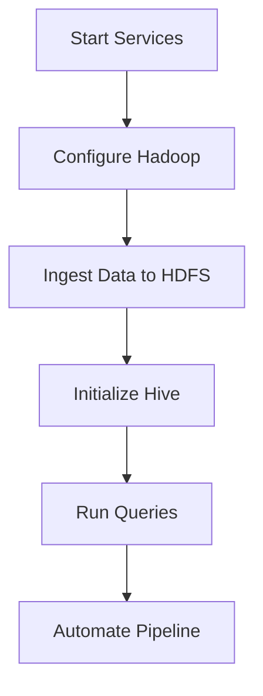

# Dynamic Data Ingestion and Storage in HDFS with Automated Hive Integration

## Project Overview
A complete pipeline to fetch census data, store in HDFS, and analyze using Hive with full automation capabilities.

## Technologies Used
- Ubuntu 20.04 LTS
- VMware Player 16
- Hadoop 3.3.6
- Hive 3.1.3
- MySQL 8.0 (Metastore)
- Python 3.8
- Shell Scripting

## Installation Guide

### 1. Setting Up Ubuntu VM

# Download Ubuntu 20.04 LTS
wget https://releases.ubuntu.com/20.04/ubuntu-20.04.6-desktop-amd64.iso

# VMware Player Configuration:
- Minimum: 4 CPU cores, 8GB RAM, 50GB disk
- Network: Bridged adapter recommended

### Software Requirements

# Essential packages
sudo apt update && sudo apt install -y \
openjdk-8-jdk \
python3-pip \
mysql-server \
maven \
wget \
ssh \

## Hadoop Environment Setup
This section outlines the steps to install Java, download and configure Hadoop, and set environment variables to prepare your system for Hadoop operations.

## 1. Install Java (OpenJDK 8)
```bash
sudo apt update
sudo apt install openjdk-8-jdk -y
```
Note: Java 8 is compatible with Hadoop 3.x versions and is recommended for stable operation.

## 2. Download and Configure Hadoop
```bash
wget https://archive.apache.org/dist/hadoop/core/hadoop-3.3.6/hadoop-3.3.6.tar.gz
tar -xzvf hadoop-3.3.6.tar.gz
mv hadoop-3.3.6 ~/bigdata/
```
* `wget`: Downloads the Hadoop tarball.
* `tar -xzvf`: Extracts the compressed archive.
* `mv`: Moves the extracted folder to a more structured location `(~/bigdata/)`.

## 3. Set Environment Variables
Add the following lines to your ~/.bashrc file to make Hadoop commands globally accessible from the terminal:
```bash
export HADOOP_HOME=~/bigdata/hadoop-3.3.6
export PATH=$PATH:$HADOOP_HOME/bin:$HADOOP_HOME/sbin
```
To apply the changes immediately, run:
```bash
source ~/.bashrc
```
This setup allows you to use commands like hadoop and start-dfs.sh from any directory in your terminal.

## Verify Hadoop Installation & Basic Configuration
After setting up Hadoop, it’s important to confirm the installation and perform the necessary configuration for a single-node cluster.

## 1. Verify Java Installation
Run the following command to check the Java version:
```bash
java -version
```
Expected output should be similar to:
```nginx
openjdk version "1.8.0_xx"
```

## 2. Verify Hadoop Installation
Check if Hadoop is installed and accessible:

```bash
hadoop version
```
## Workflow


## Basic Hadoop Configuration (Single Node Setup)
The following XML files need to be updated to set up Hadoop in pseudo-distributed (single-node) mode:

## 1. core-site.xml
Location: `$HADOOP_HOME/etc/hadoop/core-site.xml`

Replace the `<configuration>` block with:
```xml
<configuration>
  <property>
    <name>fs.defaultFS</name>
    <value>hdfs://localhost:9000</value>
  </property>
<property>
    <name>hadoop.tmp.dir</name>
    <value>/home/ubuntu/hadoop_data/tmp</value>
  </property>
</configuration>
```
## 2. hdfs-site.xml
Location: `$HADOOP_HOME/etc/hadoop/hdfs-site.xml`

Update it as:
```xml
<!-- $HADOOP_HOME/etc/hadoop/hdfs-site.xml -->
<configuration>
  <property>
    <name>dfs.replication</name>
    <value>1</value>
  </property>
  <property>
    <name>dfs.namenode.name.dir</name>
    <value>file:///home/ubuntu/hadoop_data/namenode</value>
  </property>
</configuration>
```
## Stage 1: Start Hadoop Services
Starts the Hadoop Distributed File System (HDFS) daemons:
* __NameNode__ (manages metadata and file system namespace)
* __DataNode__ (stores actual data blocks)

```bash
start-dfs.sh
```
You can verify with:
```bash
jps
```
You should see `NameNode` and `DataNode` running.

## start-yarn.sh
Starts YARN (Yet Another Resource Negotiator) daemons:

* ResourceManager (manages cluster resources)
* NodeManager (manages containers on individual nodes)
```bash
start-yarn.sh
```

Check with:
```bash
jps
```
You should see ResourceManager and NodeManager.

## Stage 2: Configure HDFS
Before first use, HDFS must be formatted:
```bash
hdfs namenode -format -force
```
* -format: Initializes HDFS metadata.
* -force: Suppresses confirmation prompt (useful in scripts).

Run only once during setup. Reformatting will delete HDFS data!

## Stage 3: Data Ingestion into HDFS
### Create Directory in HDFS
Create a directory to hold data:
```bash
hadoop fs -mkdir -p /user/hive/census_data
```
* -p: Creates parent directories if they don’t exist.

### Download and Upload Data
Stream a dataset from a URL directly into HDFS:
```bash
wget -O - https://census.gov/data.csv | hadoop fs -put - /user/hive/census_data/
```
* wget -O -: Downloads the file and writes to standard output.
* hadoop fs -put -: Reads from standard input and uploads to HDFS.
This avoids storing the file locally.

## Stage 4: Initialize Hive Metastore & Services
Initialize Hive Metastore
If using MySQL as Hive metastore DB:
```bash
schematool -dbType mysql -initSchema
```
* Initializes Hive's schema in the MySQL database.

## Start Hive Services
Start Hive services in background (non-blocking):
```bash
nohup hive --service metastore &
nohup hive --service hiveserver2 &
```
* `nohup`: Prevents the service from stopping when the terminal closes.
* `metastore`: Manages Hive metadata.
* `hiveserver2`: Enables remote SQL-like queries using JDBC/ODBC clients.

## Stage 5: Execute a Sample Hive Query
Run a HiveQL command directly from CLI:
```bash
hive -e "CREATE TABLE census_data (...); SELECT COUNT(*) FROM census_data;"
```
* hive -e: Executes a HiveQL string.
* The first part creates a Hive table (structure needs to be defined).
* The second part queries the data.

| Component       | Verification Command                     | Expected Output                                  |
|-----------------|------------------------------------------|--------------------------------------------------|
| **HDFS**        | `hadoop fs -ls /`                        | Shows root directory contents                    |
| **NameNode**    | `curl -s http://localhost:9870 \| grep namenode` | Contains `"namenode"` in HTML output             |
| **YARN**        | `yarn node -list`                        | Lists active nodes with `RUNNING` status         |
| **Hive Metastore** | `netstat -tulnp \| grep 9083`         | `tcp 0 0 0.0.0.0:9083 0.0.0.0:* LISTEN`          |
| **HiveServer2** | `beeline -u jdbc:hive2://localhost:10000 -e "SHOW DATABASES;"` | Lists `census` database                          |
| **MySQL**       | `mysql -u hiveuser -p -e "USE metastore; SHOW TABLES;"` | Shows `TBLS`, `DBS` etc.                         |
